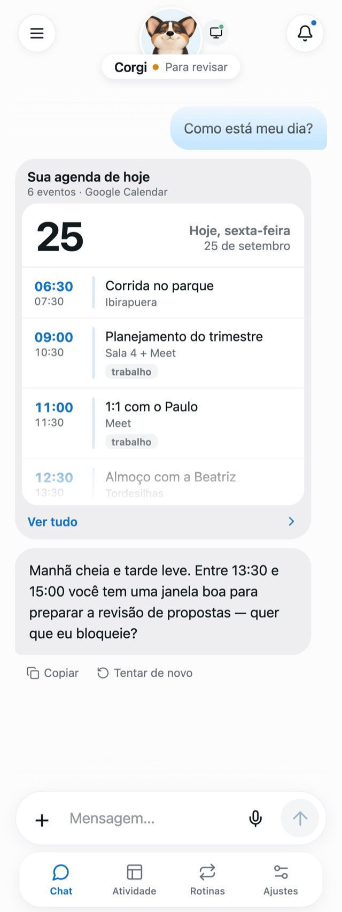
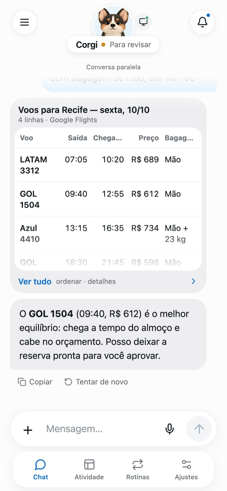
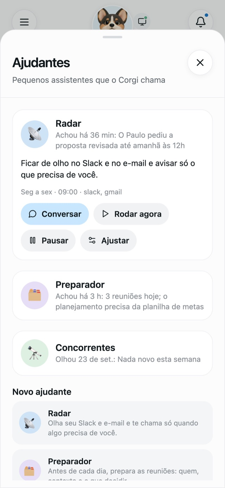
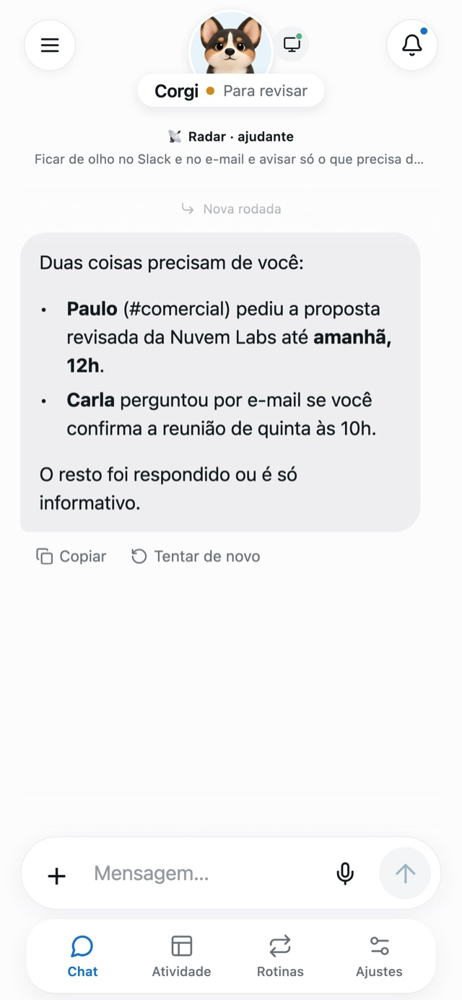
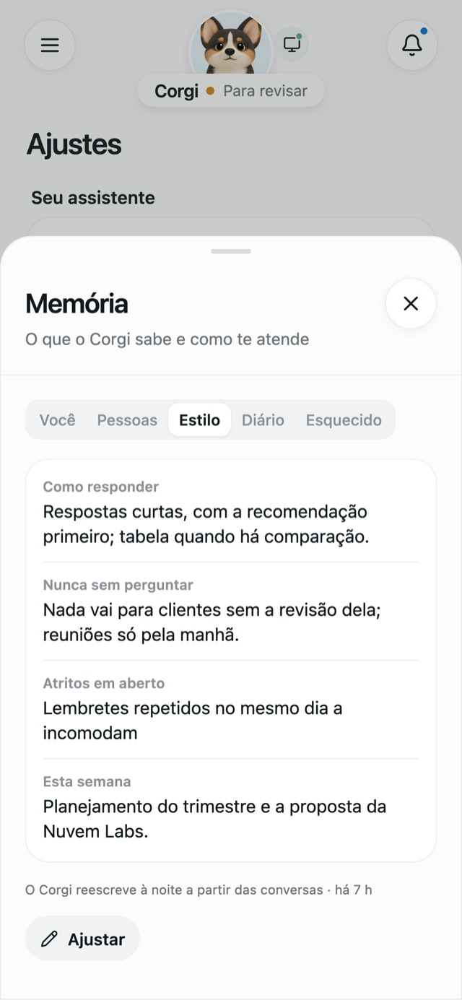
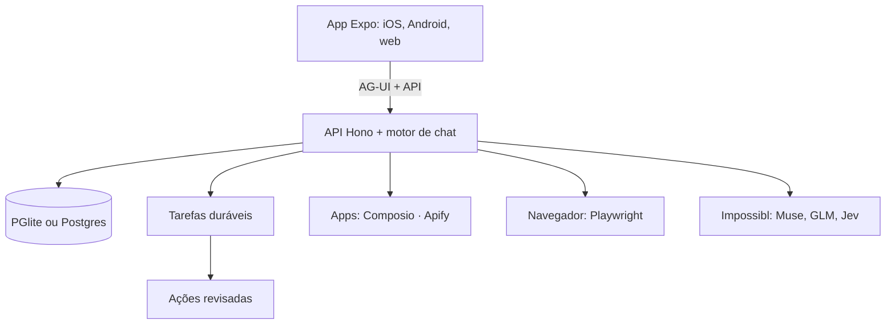

<div align="center">


# Corgi 🐾

**Um assistente executivo pessoal que você hospeda: conversa, usa seus apps, navega por você e
continua o trabalho em segundo plano. Em português, do celular ou do computador.**

*A self-hosted personal executive assistant, Brazilian Portuguese first. Each person runs their own
server with their own keys. Free for noncommercial use.*

</div>

<table>
  <tr>
    <td align="center"><br/><sub>Sua agenda, direto no chat</sub></td>
    <td align="center"><br/><sub>Pesquisa e recomenda</sub></td>
    <td align="center"><br/><sub>Trabalho em segundo plano</sub></td>
  </tr>
  <tr>
    <td align="center"><br/><sub>Ajudantes com missão própria</sub></td>
    <td align="center"><br/><sub>O Radar avisa só o que importa</sub></td>
    <td align="center"><br/><sub>Memória que aprende seu jeito</sub></td>
  </tr>
</table>

<sub>Telas reais do app, com uma pessoa e dados fictícios.</sub>

> **Derivado do [OpenMuse](https://github.com/CopilotKit/openmuse)**, criado pela
> [CopilotKit](https://github.com/CopilotKit) sob licença MIT. O Corgi começou como um fork do
> OpenMuse e evoluiu de forma independente. Obrigado à equipe e aos contribuidores do OpenMuse:
> a base de chat nativo, o navegador do agente, as revisões de ações e as tarefas duráveis vêm de
> lá. Veja [Créditos](#créditos).

## O que ele faz

| | |
| --- | --- |
| **Chat** | Respostas com elementos visuais (agenda, tabelas, números, cartões, clima, rotas), fila de mensagens, voz, fotos e arquivos, conversas paralelas. |
| **Seus apps** | Gmail, Agenda, Slack, Notion, Drive e muitos outros via [Composio](https://composio.dev), cada um com a sua permissão (pede aprovação / só ler / desligado). Apify com a sua própria chave. |
| **Navegador próprio** | Um Chromium com perfil persistente e uma aba por conversa: busca, filtra, preenche; o login é sempre seu (ele nunca digita senhas) e a compra para antes do botão final. |
| **Trabalho em segundo plano** | Tarefas com checklist e anotações que continuam com o app fechado, pausam para sua resposta ou aprovação e sobrevivem a reinícios. Rotinas (semanal, quinzenal, mensal, trimestral), alertas de página e metas. |
| **Ajudantes** | Pequenos assistentes com uma missão (Radar do Slack, Preparador de reuniões, Concorrentes…), conversa própria e só os apps que você liberar. O Corgi chama; você conversa com eles. |
| **Memória** | Lembra com a origem de cada fato, revisa as conversas de hora em hora, reflete toda noite e esquece de verdade quando você pede. |
| **Segurança** | Toda mudança fora do app (enviar, marcar, alterar, comprar) vira um cartão de aprovação. Um guarda (Jev) checa e-mails e páginas contra phishing e injeção de instruções. |
| **No celular** | Web app na tela de início com notificações (Web Push) para aprovações, perguntas e resultados. |

## Começando

Precisa de **Node 24** e **pnpm 11**.

```sh
git clone <este repositório> corgi && cd corgi
pnpm install --frozen-lockfile
pnpm corgi:setup     # cria o .env, gera as chaves secretas e pede as suas
pnpm dev             # API em http://localhost:8787
pnpm dev:browser     # o navegador do assistente (outro terminal)
pnpm dev:web         # o app em http://localhost:8081 (outro terminal)
```

Na primeira vez, o navegador do assistente precisa do Chromium:
`pnpm --dir apps/worker exec playwright install chromium`.

### As chaves

| Chave | Para quê | Obrigatória |
| --- | --- | --- |
| `IMPOSSIBL_API_KEY` | Os modelos do assistente (chat, tarefas, navegador, guarda de segurança). [Impossibl](https://impossibl.com) | Sim |
| `OPENMUSE_ACCESS_KEY`, `TOKEN_ENCRYPTION_KEY`, `WORKER_TOKEN` | Acesso ao app, criptografia das credenciais, token do navegador. Geradas pelo `corgi:setup`. | Sim (automáticas) |
| `COMPOSIO_API_KEY` | Conectar Gmail, Agenda, Slack, Notion… [Composio](https://composio.dev) | Opcional |
| Token do Apify | Coletores prontos de dados públicos. Informado no app (Ajustes › Apps › Apify). | Opcional |

Todas as opções estão comentadas no [.env.example](.env.example). Ao iniciar, o servidor avisa o que
ainda falta configurar.

### Rodar 24/7

Uma VPS pequena (ou um Mac mini) com [Tailscale](https://tailscale.com) deixa o Corgi acessível só
para os seus aparelhos, com HTTPS. O passo a passo, com scripts de instalação e atualização, está em
[docs/DEPLOY.md](docs/DEPLOY.md). No iPhone, abra o endereço no Safari e use "Adicionar à Tela de
Início".

## Como é feito



O código é organizado por domínio, e cada pasta importante tem um `AGENTS.md` com as regras dela;
comece pelo [AGENTS.md](AGENTS.md) da raiz. Toda a documentação: [docs/README.md](docs/README.md).

```sh
pnpm lint && pnpm typecheck && pnpm test   # os testes usam só dados locais: sem rede, sem contas reais
```

## Privacidade

Cada instalação é de uma pessoa. Suas conversas, memórias, arquivos e credenciais ficam no seu
servidor (`.openmuse/`); as chaves ficam no seu `.env`, que nunca vai para o git. O Corgi envia o
necessário para os provedores que você configurar (modelos, apps), e nada para os autores deste
projeto.

## Créditos

- **[OpenMuse](https://github.com/CopilotKit/openmuse)** (MIT), da [CopilotKit](https://www.copilotkit.ai):
  o projeto de origem. Arquitetura base, cliente React Native com CopilotKit, navegador persistente,
  revisão de ações, tarefas duráveis e o computador Linux opcional.
- [CopilotKit](https://github.com/CopilotKit/CopilotKit) e [AG-UI](https://github.com/ag-ui-protocol/ag-ui)
  para o protocolo e o runtime de agentes.
- [pi-agent-core / pi-ai](https://www.npmjs.com/package/@earendil-works/pi-ai), Composio, Apify,
  Playwright e Expo.

## Contribuições e suporte

**Não aceitamos pull requests.** O Corgi é compartilhado como uma contribuição, no estado em que se
encontra: não há intenção de oferecer suporte, correções ou melhorias, que só acontecem por nossa
própria liberalidade. Fique à vontade para adaptar no seu fork, dentro da licença. Veja
[CONTRIBUTING.md](CONTRIBUTING.md).

## Licença

**Uso não comercial.** O Corgi é licenciado sob a
[PolyForm Noncommercial 1.0.0](https://polyformproject.org/licenses/noncommercial/1.0.0): você pode
usar, estudar, modificar e compartilhar para fins pessoais e não comerciais (e organizações sem fins
lucrativos, pesquisa e educação). Uso comercial não é permitido. Veja [LICENSE](LICENSE).

As partes que vêm do OpenMuse continuam disponíveis sob a licença MIT original, com o aviso de
copyright dos seus autores: [LICENSE-OPENMUSE](LICENSE-OPENMUSE).
