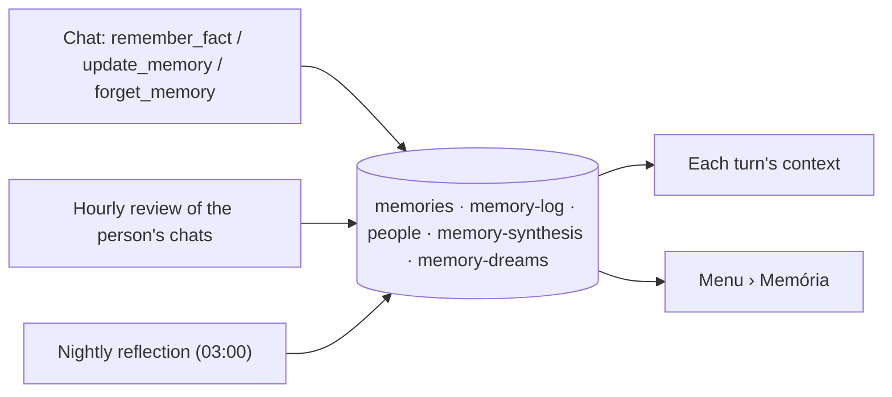

# Memory: what Corgi knows, why, and how it gets better

Corgi keeps lasting facts about the person ("memories"), each with where it came from. Three
things write them, and the person can see and change all of it under **Menu › Memória**.

## A memory

`memories` records (`packages/domain` `AgentMemory`): `text`, `tag`, `status`
(`active` / `superseded` / `retracted`), `origin` (`owner`, `chat`, `review`, `reflection`),
`salience` 1–10, `evidence` (conversation, message range, the person's words), and lineage
(`supersedes`, `supersededBy`). A correction never edits in place: it saves a new memory that
supersedes the old one. All changes go through `apps/server/src/memory/book.ts`.

## Who writes

| Writer | When | Model | Guardrails |
| --- | --- | --- | --- |
| Chat tools (`memory/tools.ts`) | The person says something lasting | Jev gate (`memory-gate.ts`) | A turn that read flagged content (TrustGuard) saves nothing; forgotten facts are refused. |
| Review (`memory/consolidate.ts`) | At most hourly, only chats with new messages | Side model proposes ≤ 8 facts with quotes; Jev decides | Only the main chat and the person's side chats (never task/routine chats). The quote must appear in one of the person's own messages; forgotten facts are skipped; without Jev nothing is kept (it only goes to the diary). |
| Reflection (`memory/dream.ts`) | Once a night from 03:00 (São Paulo), or "Refletir agora" | The automatic chat model, thinking | The model only proposes `merge` / `supersede` / `retire`; code checks every ref, uses each memory once, and loses at most 25% of memories per night. It also writes the alignment, people pages and a diary. |

Every candidate the review or chat considered, kept or not and why, goes to `memory-log` (the
diary the reflection reads). It is never put in a prompt.

## Forgetting

"Esquece isso" (or Esquecer on the screen) retracts the memory: out of every answer at once, kept
under **Esquecido** for 30 days (restorable), then purged. A retracted memory is also the tombstone
the review and the reflection check before learning something: a close rewording of it is not
learned again from old conversations. Checkpoint summaries written before the forget may still
mention it until the thread is summarized again.

## Recall (each turn)

Kept after the latest message so the cached prompt prefix stays the same (docs/MODELS.md):

- Memories: all active ones while there are ≤ 30; past that, a shortlist by shared words ×
  salience × recency, then Jev picks what matters for the request.
- **How to serve them** (`memory-synthesis`): answer style, limits, open frictions, this week.
  Written by the reflection; once the person edits it, it is pinned and the reflection leaves it.
- **People** named in the message (`people`): relation, how to address, a few notes.

`explain_memory` answers "por que você acha isso?" from the evidence and lineage; the screen's
"Por quê?" shows the same.

## Cost

Review: ≤ 1 side-model call per conversation with news per hour, plus Jev per candidate.
Reflection: 1 call per night (~15–20 s). Nothing runs without an Impossibl key.

## Not yet

Embeddings / semantic search, standing intents ("quando X aparecer, faça Y"), and a skill
workshop are left for later; see the advisor notes in the project history.
