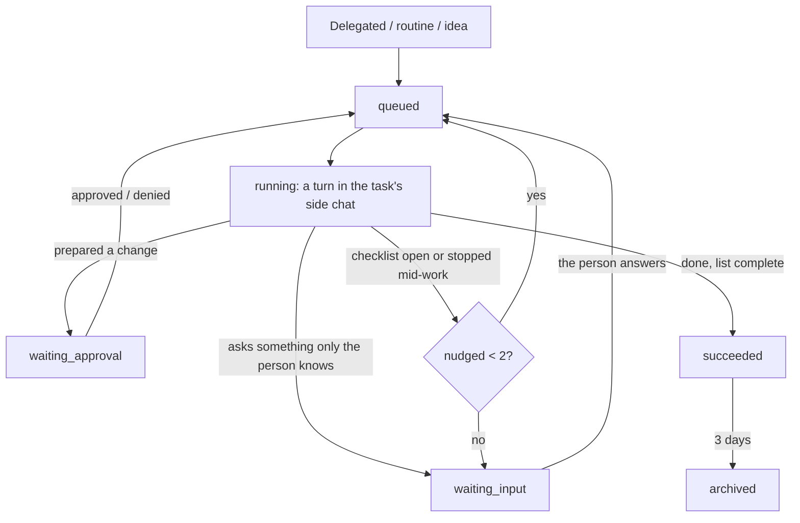

# Background tasks: the flow

A task is work that continues without the person watching: something delegated in chat, a
routine's run, an accepted idea. Each one is a **side chat** the server runs on the same engine
as the main chat (same model, prompt, tools and approval cards).

- **Its chat:** `agent/chat-task.ts` creates the side chat and runs each turn; the worker's own
  messages are notes (`task-note-…`), shown small in the app, with guidance for the model
  (`» …`) hidden.
- **Checklist and notes:** `update_todos` / `write_notes` (`agent/todos.ts`, `notes.ts`) live per
  conversation (`thread-work`), reach the model every turn and become the task's plan (steps in
  Atividade and in the task header).
- **Approvals:** changes become cards; a decision re-queues the task, which is told what ran or
  was denied and continues. Always-allowed actions run without asking; a routine with
  "Aprovar sozinho" also runs safe actions itself (never sends, deletes or payments).
- **Not getting stuck:** the same call a third time in one turn is refused with a way out, the
  fifth ends the turn (`pi.ts` `repeatedCall`); an unfinished turn is continued at most twice,
  then the person is asked, naming what is left; a routine never starts while its previous run
  is still going.
- **Skills:** an `@skill` named in the task's request applies to every round.
- **The person's side:** news becomes a notification and a push (docs/NOTIFICATIONS.md); the
  task's conversation shows it working live; "Instruir outra coisa" on a card declines and says
  what to do instead.
